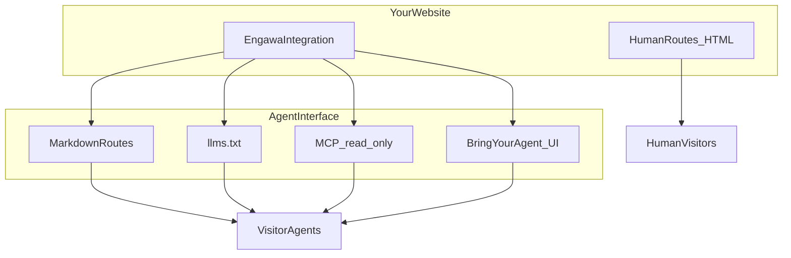

# Engawa

The open toolkit for agent-native websites.

**Bring your agent.**

A website gets two first-class interfaces: one for humans (HTML) and one for AI agents (structured discovery, markdown, MCP). Visitors can use the agent they already trust instead of another embedded chatbot on your site.

## Why Engawa

Traditional websites optimize for humans browsing HTML. Agents scraping that HTML get noisy, incomplete, or stale context. Engawa gives agents a deliberate read surface—markdown pages, `llms.txt`, and MCP resources—while you keep full control of what is public.

Engawa does not replace your site CMS or framework. It sits beside your human routes and exposes only what you register through a **content adapter**.

## What Engawa gives a website

| Surface                  | Purpose                                                         |
| ------------------------ | --------------------------------------------------------------- |
| HTML / UI                | Your existing human interface                                   |
| Markdown alternates      | Clean `text/markdown` pages for agents (`/about.md`, etc.)      |
| `llms.txt`               | Discovery index ([llms.txt v2](https://llmstxt.org/))           |
| MCP                      | Streamable HTTP endpoint with resources + bounded `search_site` |
| Bring Your Agent (React) | Provider-neutral UX so visitors connect their own agent         |



## 5-minute quick start (npm)

This uses **published packages** from the public npm registry—not a clone of this monorepo.

**Requirements:** Node.js 24+.

```bash
npm install \
  @thierry-gilgen-ict/engawa-core@0.1.1 \
  @thierry-gilgen-ict/engawa-discovery@0.1.1 \
  @thierry-gilgen-ict/engawa-mcp@0.1.1
```

```typescript
import {
  createEngawa,
  StaticContentAdapter,
  validateEngawaConfig,
} from "@thierry-gilgen-ict/engawa-core";
import { generateLlmsTxt } from "@thierry-gilgen-ict/engawa-discovery";
import { createEngawaPublicMcpServer } from "@thierry-gilgen-ict/engawa-mcp";

const config = validateEngawaConfig({
  site: {
    name: "My Site",
    canonicalUrl: "https://www.example.com",
    description: "A small public website with an agent interface.",
    language: "en",
  },
  agentInterface: { enabled: true, public: true },
  security: { publicDefault: "read-only" },
  metadata: { version: "0.1.1" },
});

const adapter = new StaticContentAdapter(config.site.canonicalUrl, [
  {
    id: "about",
    title: "About",
    path: "/about.md",
    content: "# About\n\nPublic about page content.",
  },
  {
    id: "services",
    title: "Services",
    path: "/services.md",
    content: "# Services\n\nWhat we offer.",
  },
]);

const engawa = createEngawa(config, adapter);

// llms.txt body
const resources = await engawa.listResources();
const llmsTxt = generateLlmsTxt(engawa.config, resources);

// MCP server (wire to your HTTP framework)
const mcpServer = await createEngawaPublicMcpServer(engawa);
```

Wire `llmsTxt` to `GET /llms.txt` and the MCP server to `POST /mcp` (or use `createEngawaPublicMcpHandler` with your framework's request/response objects). See [Getting started](docs/getting-started.md) and [Next.js integration](docs/integrations/nextjs.md).

**React UI (optional):**

```bash
npm install @thierry-gilgen-ict/engawa-react@0.1.0 react react-dom
```

See [@thierry-gilgen-ict/engawa-react](packages/react/README.md).

## Packages

| Package                                | When you need it                            | When you don't                                          |
| -------------------------------------- | ------------------------------------------- | ------------------------------------------------------- |
| `@thierry-gilgen-ict/engawa-core`      | Config, resources, adapters, `createEngawa` | You only want React UI without Engawa corpus (unlikely) |
| `@thierry-gilgen-ict/engawa-discovery` | `llms.txt`, discovery link metadata         | You build discovery files entirely by hand              |
| `@thierry-gilgen-ict/engawa-mcp`       | Public MCP server / handler, `search_site`  | You don't expose MCP                                    |
| `@thierry-gilgen-ict/engawa-react`     | Bring Your Agent dialog and provider picker | Headless/agent-only sites with no BYA button            |

**Not shipped:** `engawa-nextjs`, `engawa-cli`, `engawa-analytics`. Next.js sites integrate via documented patterns—see [docs/integrations/nextjs.md](docs/integrations/nextjs.md).

## Production examples

Both sites run Engawa from npm packages with site-specific adapters (no Engawa core forks).

| Site                                                           | Agents page                                                                                           | What it proves                                                                         |
| -------------------------------------------------------------- | ----------------------------------------------------------------------------------------------------- | -------------------------------------------------------------------------------------- |
| [Thierry Gilgen ICT](https://www.thierry-gilgen-ict.ch/agents) | [llms.txt](https://www.thierry-gilgen-ict.ch/llms.txt) · [MCP](https://www.thierry-gilgen-ict.ch/mcp) | Editorial Field Notes content model, dynamic public pages                              |
| [The Old Hand of Asia](https://theoldhandofasia.ch/agents)     | [llms.txt](https://theoldhandofasia.ch/llms.txt) · [MCP](https://theoldhandofasia.ch/mcp)             | Bilingual DE/EN, mixed CMS/static human-public sources, strict public/private boundary |

Details: [docs/production-references.md](docs/production-references.md).

## Bring Your Agent

Engawa's React components implement **provider-neutral** connection UX:

- ChatGPT
- Claude
- Grok
- Cursor
- Other MCP client (canonical fallback)

Engawa does **not** claim one-click remote MCP setup for every provider. When a vendor has no documented deep link, the UI offers copy actions, setup instructions, and generic MCP—see [provider capability matrix](docs/providers/provider-capability-matrix.md).

Provider availability and setup can vary by provider plan, workspace policy, and product version. See [capability matrix](docs/providers/provider-capability-matrix.md).

## Security defaults

**PUBLIC · READ-ONLY · NO MUTATIONS BY DEFAULT**

- Public MCP exposes only resources your adapter registers.
- v0.1 ships one public tool: `search_site` (bounded query and results).
- No unauthenticated write tools, no env/secret access, no arbitrary filesystem reads.

**Critical integration rule:** Engawa's public corpus must match what anonymous human visitors see—not merely what exists in a CMS or database. See [Content publication rule](docs/content-publication.md).

Full model: [docs/security-model.md](docs/security-model.md).

## Status

- Current npm registry: `@thierry-gilgen-ict/engawa-core@0.1.1`, `@thierry-gilgen-ict/engawa-discovery@0.1.1`, `@thierry-gilgen-ict/engawa-mcp@0.1.1`, `@thierry-gilgen-ict/engawa-react@0.1.0`.
- Early **v0.x** foundation on npm; packages may diverge by semver.
- **Two production reference integrations** (see above).
- Public read-only surface proven; authenticated and mutating capabilities **not** shipped.
- API may change before **1.0**.

## Monorepo development

Clone this repository to work on Engawa itself or run the included example:

```bash
pnpm install
pnpm build
pnpm --filter minimal-site start
```

Example endpoints: `http://127.0.0.1:3847/llms.txt`, `http://127.0.0.1:3847/mcp`. See [CONTRIBUTING.md](CONTRIBUTING.md).

## Choose your path

| You are…                                             | Start here                                                                                                               |
| ---------------------------------------------------- | ------------------------------------------------------------------------------------------------------------------------ |
| A developer adding Engawa to an **existing website** | [Integrating an existing site](docs/integrating-an-existing-site.md)                                                     |
| Using a **coding agent** to integrate Engawa         | [Agent integration playbook](docs/agent-integration-playbook.md) · [copy-paste prompt](docs/prompts/integrate-engawa.md) |
| **Upgrading** an existing Engawa integration         | [Upgrading](docs/upgrading.md) · [Compatibility](docs/compatibility.md)                                                  |
| Starting from an **empty project**                   | [Getting started](docs/getting-started.md)                                                                               |
| Working **in this monorepo**                         | [AGENTS.md](AGENTS.md) · [CONTRIBUTING.md](CONTRIBUTING.md)                                                              |

## Documentation

| Doc                                                                  | Topic                                     |
| -------------------------------------------------------------------- | ----------------------------------------- |
| [Integrating an existing site](docs/integrating-an-existing-site.md) | Add Engawa to a live website              |
| [Agent integration playbook](docs/agent-integration-playbook.md)     | Coding-agent integration sequence         |
| [Integration acceptance](docs/integration-acceptance.md)             | Done-when checklist                       |
| [Upgrading](docs/upgrading.md)                                       | Safe consumer upgrades                    |
| [Compatibility](docs/compatibility.md)                               | Tested package sets                       |
| [Getting started](docs/getting-started.md)                           | Empty external project quick start        |
| [Next.js integration](docs/integrations/nextjs.md)                   | Route handlers, host app responsibilities |
| [Headless CMS integration](docs/integrations/headless-cms.md)        | Node/TS frontend + CMS API pattern        |
| [Production references](docs/production-references.md)               | Live sites and portability evidence       |
| [Content publication](docs/content-publication.md)                   | Human-public corpus rule                  |
| [Security model](docs/security-model.md)                             | Threat model and launch checklist         |
| [Roadmap](docs/roadmap.md)                                           | What's done and what's deferred           |
| [Distribution Map](docs/distribution-map.md)                         | Optional community showcase; CLI in monorepo |
| [Releasing](docs/releasing.md)                                       | Maintainer npm publish process            |

## Distribution Map (optional)

Engawa never phones home. A voluntary **Join the map** flow lets site operators list their public Engawa integration in the community showcase. The CLI is implemented in this monorepo (`packages/map`); npm publication is deferred until after production acceptance ([DM3A contract](docs/distribution-map-production-launch.md)). Staging registry is live; production is not deployed. See [Distribution Map](docs/distribution-map.md).

## Contributing

See [CONTRIBUTING.md](CONTRIBUTING.md). Code of conduct: [CODE_OF_CONDUCT.md](CODE_OF_CONDUCT.md).

## License

- **Source code:** [MIT](LICENSE)
- **Documentation and profiles:** [CC BY 4.0](docs/LICENSE)

Copyright Thierry Gilgen ICT, 2026.
