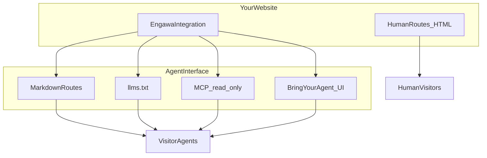

# Engawa 縁側


> **Get Your Website Agent-Ready.**

**The open toolkit for agent-native websites. Bring your agent.**

In traditional Japanese architecture, an **engawa (縁側)** is the narrow transitional space running between the interior of a building and the outside — often between rooms and a garden. It is neither fully inside nor fully outside: it is a threshold that connects the two.

**Engawa brings that idea to the web.** It exposes the **same human-public information** your site already shows people through clean, bounded agent-facing representations—and optional read-only retrieval interfaces.

**Agents can read HTML.** Browser pages are optimized for people: layout, navigation, scripts, cookie banners, and presentation markup often surround the public prose an agent actually needs. Engawa does not claim HTML is unreadable. It offers a **cleaner, smaller, more deterministic** representation of the **same** public content, with explicit corpus boundaries you control.

**Agent-ready** means an agent can retrieve the site's intended public content through deterministic machine-readable representations—without relying only on reverse-engineering browser presentation.

**Engawa makes your website agent-ready.** It adds intentional machine-readable surfaces alongside your existing human website—structured public content, Markdown, MCP, and Bring Your Agent UX—while you keep control of what is exposed.

**One website. Two first-class interfaces:** HTML for people, structured interfaces for agents—not because HTML is unreadable, but because both audiences deserve an appropriate surface.

Engawa does not replace your website. Engawa does not replace your CMS. Engawa does not add another proprietary chatbot. Engawa does not replace schema.org, sitemaps, robots.txt, or OpenAPI where those already solve your problem. Engawa gives the existing website a deliberate agent interface.

## What Engawa does

With Engawa, your website can:

- **Expose the same public content** through clean, intentional agent-facing documents instead of relying only on full browser HTML retrieval.
- **Publish explicit machine-readable entry points** such as `llms.txt` and Markdown metadata. Consumer support varies; Engawa does **not** assume automatic discovery.
- **Expose structured content** as deterministic Markdown resources (additive to HTML, not a replacement).
- **Offer a safe public MCP interface** for resource listing, reading, and bounded `search_site` when agents are explicitly connected.
- **Support Bring Your Agent** so visitors can use the AI tool they already trust.
- **Stay under your control** — your adapter defines the public corpus and Engawa is read-only by default.

**Discovery note:** Publishing an agent surface does not guarantee a particular AI provider will automatically discover, fetch, or use it. `SURFACE EXISTS ≠ SURFACE FETCHED ≠ SURFACE USED ≠ OUTPUT IMPROVED`. Measure provider behavior rather than assuming it.

No runtime phone-home. Joining the public Engawa Distribution Map is optional and operator-initiated.

See [Do you need Engawa?](docs/do-you-need-engawa.md) if you are deciding whether to adopt Engawa at all.

## Agent surfaces

| Surface                  | Purpose                                                         |
| ------------------------ | --------------------------------------------------------------- |
| HTML / UI                | Your existing human interface                                   |
| Markdown alternates      | Clean `text/markdown` pages for agents (`/about.md`, etc.)      |
| `llms.txt`               | Discovery index ([llms.txt v2](https://llmstxt.org/))           |
| MCP                      | Streamable HTTP endpoint with resources + bounded `search_site` |
| Bring Your Agent (React) | Provider-neutral UX so visitors connect their own agent         |



## 5-minute quick start (npm)

This uses **published packages** from the public npm registry—not a clone of this monorepo.

**Requirements:** Node.js 24+.

```bash
npm install \
  @thierry-gilgen-ict/engawa-core@0.1.1 \
  @thierry-gilgen-ict/engawa-discovery@0.1.1 \
  @thierry-gilgen-ict/engawa-mcp@0.1.1
```

```typescript
import {
  createEngawa,
  StaticContentAdapter,
  validateEngawaConfig,
} from "@thierry-gilgen-ict/engawa-core";
import { generateLlmsTxt } from "@thierry-gilgen-ict/engawa-discovery";
import { createEngawaPublicMcpHandler } from "@thierry-gilgen-ict/engawa-mcp";

const config = validateEngawaConfig({
  site: {
    name: "My Site",
    canonicalUrl: "https://www.example.com",
    description: "A small public website with an agent interface.",
    language: "en",
  },
  agentInterface: { enabled: true, public: true },
  security: { publicDefault: "read-only" },
  metadata: { version: "0.1.1" },
});

const adapter = new StaticContentAdapter(config.site.canonicalUrl, [
  {
    id: "about",
    title: "About",
    path: "/about.md",
    content: "# About\n\nPublic about page content.",
  },
  {
    id: "services",
    title: "Services",
    path: "/services.md",
    content: "# Services\n\nWhat we offer.",
  },
]);

const engawa = createEngawa(config, adapter);

// llms.txt body
const resources = await engawa.listResources();
const llmsTxt = generateLlmsTxt(engawa.config, resources);

// MCP handler — wire to your HTTP route (see complete example below)
const mcpHandler = createEngawaPublicMcpHandler(engawa);
// return mcpHandler.fetch(request);
```

Wire `llmsTxt` to `GET /llms.txt` and MCP to `/mcp` with host guards and rate limits. **Complete Next.js App Router example:** [docs/examples/nextjs-mcp-app-router.md](docs/examples/nextjs-mcp-app-router.md). See also [Getting started](docs/getting-started.md) and [Next.js integration](docs/integrations/nextjs.md).

**React UI (optional):**

```bash
npm install @thierry-gilgen-ict/engawa-react@0.1.0 react react-dom
```

See [@thierry-gilgen-ict/engawa-react](packages/react/README.md).

## Packages

| Package                                | When you need it                            | When you don't                                          |
| -------------------------------------- | ------------------------------------------- | ------------------------------------------------------- |
| `@thierry-gilgen-ict/engawa-core`      | Config, resources, adapters, `createEngawa` | You only want React UI without Engawa corpus (unlikely) |
| `@thierry-gilgen-ict/engawa-discovery` | `llms.txt`, discovery link metadata         | You build discovery files entirely by hand              |
| `@thierry-gilgen-ict/engawa-mcp`       | Public MCP server / handler, `search_site`  | You don't expose MCP                                    |
| `@thierry-gilgen-ict/engawa-react`     | Bring Your Agent dialog and provider picker | Headless/agent-only sites with no BYA button            |
| `@thierry-gilgen-ict/engawa-cli`       | `inspect`, `init`, `doctor` for sites/repos | You only integrate Engawa into a site (not develop it)  |

**Not shipped:** `engawa-nextjs`, `engawa-analytics`. Next.js sites integrate via documented patterns—see [docs/integrations/nextjs.md](docs/integrations/nextjs.md).

```bash
npm install @thierry-gilgen-ict/engawa-cli@0.1.0
```

See [@thierry-gilgen-ict/engawa-cli](packages/cli/README.md).

## Production examples

Both sites run Engawa from npm packages with site-specific adapters (no Engawa core forks).

| Site                                                           | Agents page                                                                                           | What it proves                                                                         |
| -------------------------------------------------------------- | ----------------------------------------------------------------------------------------------------- | -------------------------------------------------------------------------------------- |
| [Thierry Gilgen ICT](https://www.thierry-gilgen-ict.ch/agents) | [llms.txt](https://www.thierry-gilgen-ict.ch/llms.txt) · [MCP](https://www.thierry-gilgen-ict.ch/mcp) | Editorial Field Notes content model, dynamic public pages                              |
| [The Old Hand of Asia](https://theoldhandofasia.ch/agents)     | [llms.txt](https://theoldhandofasia.ch/llms.txt) · [MCP](https://theoldhandofasia.ch/mcp)             | Bilingual DE/EN, mixed CMS/static human-public sources, strict public/private boundary |

Details: [docs/production-references.md](docs/production-references.md).

## Bring Your Agent

Engawa's React components implement **provider-neutral** connection UX:

- ChatGPT
- Claude
- Grok
- Cursor
- Other MCP client (canonical fallback)

Engawa does **not** claim one-click remote MCP setup for every provider. When a vendor has no documented deep link, the UI offers copy actions, setup instructions, and generic MCP—see [provider capability matrix](docs/providers/provider-capability-matrix.md).

Provider availability and setup can vary by provider plan, workspace policy, and product version. See [capability matrix](docs/providers/provider-capability-matrix.md).

## Security defaults

**PUBLIC · READ-ONLY · NO MUTATIONS BY DEFAULT**

- Public MCP exposes only resources your adapter registers.
- v0.1 ships one public tool: `search_site` (bounded query and results).
- No unauthenticated write tools, no env/secret access, no arbitrary filesystem reads.

**Critical integration rule:** Engawa's public corpus must match what anonymous human visitors see—not merely what exists in a CMS or database. See [Content publication rule](docs/content-publication.md).

Full model: [docs/security-model.md](docs/security-model.md).

## Status

- Current npm registry: `@thierry-gilgen-ict/engawa-core@0.1.1`, `@thierry-gilgen-ict/engawa-discovery@0.1.1`, `@thierry-gilgen-ict/engawa-mcp@0.1.1`, `@thierry-gilgen-ict/engawa-react@0.1.0`, `@thierry-gilgen-ict/engawa-map@0.1.0`.
- Early **v0.x** foundation on npm; packages may diverge by semver; **API may change before 1.0**.
- **Node.js 24+** required for published packages.
- **Two production reference integrations** on Next.js (see above).
- **Public read-only MCP only** in v0.1 — no authenticated or mutating MCP shipped.
- **Engawa runtime does not phone home** — Distribution Map registration is voluntary and operator-initiated.
- **Distribution Map CLI is live** on npm (`@thierry-gilgen-ict/engawa-map@0.1.0`); production registry at [engawa-map.thierry-gilgen-ict.ch](https://engawa-map.thierry-gilgen-ict.ch).

Public announcement blurb: [ANNOUNCE.md](ANNOUNCE.md). Security: [SECURITY.md](SECURITY.md).

## Monorepo development

Clone this repository to work on Engawa itself or run the included example:

```bash
pnpm install
pnpm build
pnpm --filter minimal-site start
```

Example endpoints: `http://127.0.0.1:3847/llms.txt`, `http://127.0.0.1:3847/mcp`. See [CONTRIBUTING.md](CONTRIBUTING.md).

## Choose your path

| You are…                                             | Start here                                                                                                               |
| ---------------------------------------------------- | ------------------------------------------------------------------------------------------------------------------------ |
| A developer adding Engawa to an **existing website** | [Integrating an existing site](docs/integrating-an-existing-site.md)                                                     |
| Using a **coding agent** to integrate Engawa         | [Agent integration playbook](docs/agent-integration-playbook.md) · [copy-paste prompt](docs/prompts/integrate-engawa.md) |
| **Upgrading** an existing Engawa integration         | [Upgrading](docs/upgrading.md) · [Compatibility](docs/compatibility.md)                                                  |
| Starting from an **empty project**                   | [Getting started](docs/getting-started.md)                                                                               |
| Working **in this monorepo**                         | [AGENTS.md](AGENTS.md) · [CONTRIBUTING.md](CONTRIBUTING.md) · [Engawa Inspector (source)](packages/cli/README.md)        |

## Documentation

| Doc                                                                      | Topic                                                                      |
| ------------------------------------------------------------------------ | -------------------------------------------------------------------------- |
| [Integrating an existing site](docs/integrating-an-existing-site.md)     | Add Engawa to a live website                                               |
| [Agent integration playbook](docs/agent-integration-playbook.md)         | Coding-agent integration sequence                                          |
| [Integration acceptance](docs/integration-acceptance.md)                 | Done-when checklist                                                        |
| [Upgrading](docs/upgrading.md)                                           | Safe consumer upgrades                                                     |
| [Compatibility](docs/compatibility.md)                                   | Tested package sets                                                        |
| [Getting started](docs/getting-started.md)                               | Empty external project quick start                                         |
| [Complete MCP route example](docs/examples/nextjs-mcp-app-router.md)     | Copy-paste Next.js App Router wiring                                       |
| [Custom ContentAdapter example](docs/examples/custom-content-adapter.md) | Production-shaped adapter pattern                                          |
| [Next.js integration](docs/integrations/nextjs.md)                       | Route handlers, host app responsibilities                                  |
| [Headless CMS integration](docs/integrations/headless-cms.md)            | Node/TS frontend + CMS API pattern                                         |
| [Production references](docs/production-references.md)                   | Live sites and portability evidence                                        |
| [Content publication](docs/content-publication.md)                       | Human-public corpus rule                                                   |
| [Security model](docs/security-model.md)                                 | Threat model and launch checklist                                          |
| [Roadmap](docs/roadmap.md)                                               | What's done and what's deferred                                            |
| [Distribution Map](docs/distribution-map.md)                             | Optional community showcase; `@thierry-gilgen-ict/engawa-map@0.1.0` on npm |
| [Releasing](docs/releasing.md)                                           | Maintainer npm publish process                                             |

## Distribution Map (optional)

Engawa never phones home. A voluntary **Join the map** flow lets site operators list their public Engawa integration at [engawa-map.thierry-gilgen-ict.ch](https://engawa-map.thierry-gilgen-ict.ch). Install `@thierry-gilgen-ict/engawa-map@0.1.0` and run `npx engawa-map register`. First registration is `PENDING`; public listing requires manual approval. See [Distribution Map](docs/distribution-map.md).

## Contributing

See [CONTRIBUTING.md](CONTRIBUTING.md). Code of conduct: [CODE_OF_CONDUCT.md](CODE_OF_CONDUCT.md).

## License

- **Source code:** [MIT](LICENSE)
- **Documentation and profiles:** [CC BY 4.0](docs/LICENSE)

Copyright Thierry Gilgen ICT, 2026.
